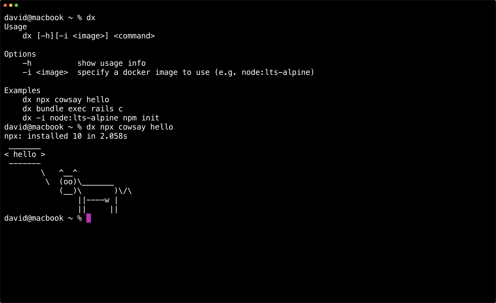

# dx

Execute commands in a sandbox. Docker is the only dependency.



## Usage

The current directory is mounted in a Docker [volume](https://docs.docker.com/engine/reference/commandline/run/#mount-volume--v---read-only) and set as the [working directory](https://docs.docker.com/engine/reference/commandline/run/#set-working-directory--w) inside the container at `/dxdir`.

```shell
dx [-h] <command>
  -h  show usage info
```

- `dx node --version` - print the version of `node` to the console
- `dx irb` - launch an interactive `irb` repl

You can run `dx -h` if you forget how to use it.

### Supported commands

- `node` `npm` `npx` `yarn`
- `php` `composer`
- `ruby` `bundle` `bundler` `gem` `irb`

## Install

Installation is quick.

```shell
# clone the repo
git clone https://github.com/voraciousdev/dx.git

# make it available anywhere
mv ./dx/dx /usr/local/bin
```