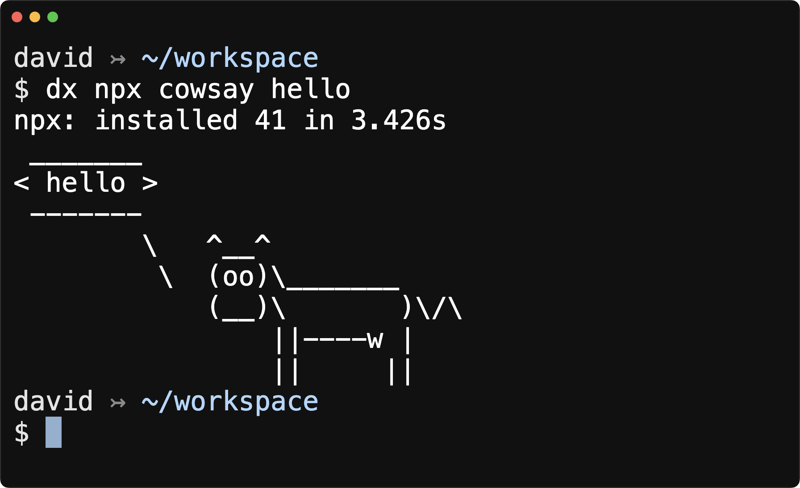

# dx

Execute commands in a sandbox. Docker is the only dependency.



## Install

Installation is quick.

```shell
# clone the repo
git clone https://github.com/voraciousdev/dx.git

# make it available anywhere
mv ./dx/dx /usr/local/bin
```

## Use

You can run `dx -h` for usage info and examples.

```shell
Usage
    dx [-hs][-i <image>][-p <port>] <command>

Options
    -h          show usage info
    -i <image>  specify a docker image to use (e.g. node:lts-alpine)
    -p <port>   specify port binding (as host:guest) for docker (e.g. 5000:80)
    -s          launch an interactive shell

Examples
    dx npx cowsay hello
    dx bundle exec rails c
    dx youtube-dl https://youtu.be/LfhkoCAK6aA
    dx -i node:lts-alpine npm init
    dx -p 5001:5001 dotnet run
    dx -s composer
```

### Examples

Download a YouTube video.

```shell
dx youtube-dl https://youtu.be/LfhkoCAK6aA
```

Launch an `irb` console.

```shell
dx irb
```

The current directory is mounted in a Docker [volume](https://docs.docker.com/engine/reference/commandline/run/#mount-volume--v---read-only) and set as the [working directory](https://docs.docker.com/engine/reference/commandline/run/#set-working-directory--w) inside the container at `/dxdir`.

### Supported commands

- `cargo`
- `deno`
- `dotnet`
- `ffmpeg`
- `node` `npm` `npx` `yarn`
- `php` `composer`
- `python` `pip`
- `ruby` `bundle` `bundler` `gem` `irb`
- `youtube-dl`

#### Run any command by specifying a Docker image

If a command is not yet supported, you can still use `dx` by specifying a Docker image to use with the `-i` flag.

```shell
dx -i node:lts-alpine npm init
```

### Expose a port to the host

Expose a port to the host with the `-p` flag.

```shell
# just like a docker port binding (host:guest)
dx -p 5000:5000 npx serve .
```

### Run multiple commands by launching an interactive shell

Launch an interactive shell for a given command with the `-s` flag.

```shell
dx -s composer
```
